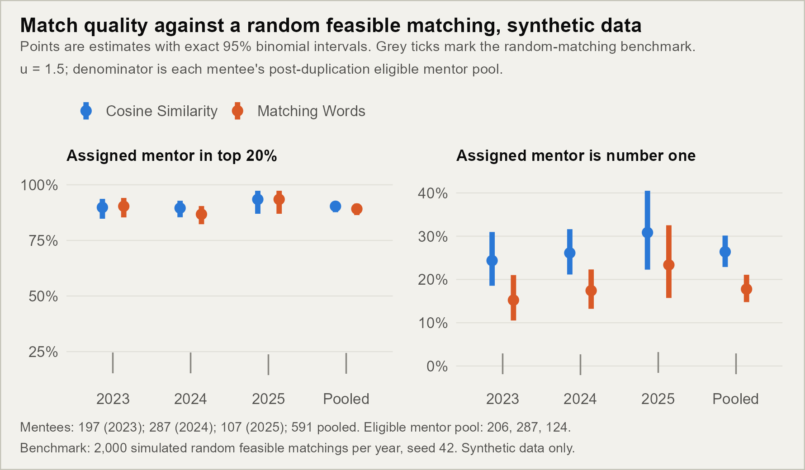
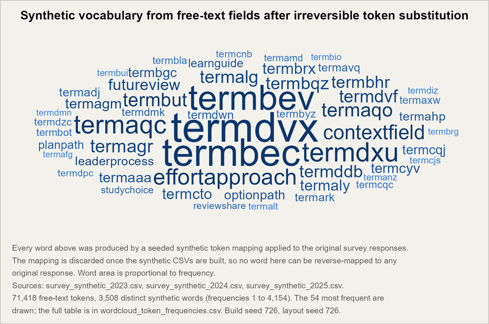

# Gale-Shapley mentorship matching — synthetic, reproducible demonstration

A public-safe reproduction of a mentorship-pairing analysis, built entirely on
**synthetic data**. It pairs mentees to mentors with the Gale-Shapley stable matching
algorithm under two symmetric text-similarity scoring methods, measures how good the
resulting assignments are against a random-matching benchmark, and runs the
repository's predefined fairness checks.

**These synthetic results do not establish performance on real employee data.** No
real survey response, name, identifier, or business label appears anywhere in this
repository.

## Results

| Result | Estimate | Uncertainty or benchmark | Interpretation |
|---|---|---|---|
| Assigned mentor in top 20% of predicted compatibility | **91.3%** (Cosine Similarity)<br>**92.5%** (Matching Words) | 95% CI [88.8, 93.5] and [90.1, 94.5]<br>Random feasible matching: **19.7%** [16.7, 23.0] | Roughly 4.6x the random benchmark. The two methods' intervals overlap, but see the equivalence test below — overlap is not equivalence. |
| Assigned mentor is the predicted number one | **29.9%** (Cosine Similarity)<br>**30.4%** (Matching Words) | 95% CI [26.3, 33.8] and [26.7, 34.3]<br>Random feasible matching: **0.48%** [0.0, 1.0] | About 63x the random benchmark. |
| Two methods equivalent within ±5 pp (TOST) | Matching Words − Cosine Similarity = **+2.38 pp** | Pooled 90% CI **[−0.76, +5.52]** pp, margin ±5 pp | **Fail.** The interval breaches the margin, so equivalence is not established on synthetic data. Every individual year fails too. |
| Predefined fairness checks passed | **1 of 3 binding gates** | Disparate Impact passes (DI 0.902, 90% CI [0.874, 0.932], floor 0.80). Mean percentile gap and FOSD equivalence are both flagged. | The procedure is **not** shown to be fair on these data. Senior mentees (Grades 5+) do measurably better than junior mentees. |

Across approved synthetic simulations, the algorithm produced assigned mentors in the
top 20% of predicted compatibility for 91.3% (Cosine Similarity) and 92.5% (Matching
Words) of mentees, and assigned the predicted number-one mentor for 29.9% and 30.4%,
under the stated simulation and benchmark conditions. **The procedure passed one of
the three explicitly defined binding fairness checks listed below — the Disparate
Impact four-fifths gate — and was flagged on the other two, the mean percentile-gap
and FOSD equivalence tests, at their stated thresholds.** These synthetic results do
not establish performance on real employee data.

> The wording above departs deliberately from a blanket "passed the fairness checks"
> claim. Two of the three predefined gates do not pass, and a high compatibility rate
> is not evidence of fairness.

### Sample sizes, simulations, seeds

| Year | Mentees | Eligible mentor pool | Mentors before duplication | Top-20% cutoff rank |
|---|---|---|---|---|
| 2023 | 197 | 206 | 206 | 41 |
| 2024 | 284 | 284 | 233 | 56 |
| 2025 | 107 | 124 | 124 | 24 |
| Pooled | 588 | — | — | — |

- **Populations:** 3 synthetic survey years (2023-2025), plus 3 prior-year match files.
- **Parameter settings:** 12 values of the survey-match weight *u*, from 0.9 to 2.0 in
  steps of 0.1. Headline figures use *u* = 1.5.
- **Methods:** Cosine Similarity and Matching Words, compared symmetrically. Neither
  is a baseline.
- **Benchmark simulations:** 2,000 random feasible matchings per year, seed 42.
- **Seeds:** matching and tie-breaking seed **88** (`params$seed` in the Rmd);
  analysis and benchmark seed **42**; synthetic vocabulary build seed **726**;
  word-cloud layout seed **726**.

### Definitions and denominators

**Top-20% compatibility rate.** The share of mentees whose assigned mentor ranks in
the best 20% of that mentee's eligible mentor pool. A mentee with pool size *N* counts
as a success when the assigned mentor's rank is at most `floor(0.20 x N)` — the
conservative reading of "top 20%" (41 of 206 rather than 42, for 2023).

**Number-one compatibility rate.** The share of mentees assigned the single
highest-predicted-compatibility mentor, i.e. rank exactly 1.

**Eligible mentors — the denominator decision.** The pipeline builds a complete mentee
x mentor grid and ranks every mentor for every mentee, so a mentee's eligible pool is
every mentor row in that grid. When mentees outnumber mentors, the pipeline duplicates
willing mentors until the counts match, and those duplicate rows are ranked like any
other. **The pool used here is the post-duplication pool** (206 / 284 / 124), verified
against the grid size: 197x206 = 40,582, 284x284 = 80,656, 107x124 = 13,268 rows. The
choice matters — in 2024 the pre-duplication pool is 233, not 284, which would change
the cutoff rank from 56 to 46.

This deliberately models **full pairing**: every mentee is paired and mentors are
duplicated as needed, with no two-mentee cap. The production system this analysis is
modelled on did cap mentors and did leave some mentees unmatched. A mentor holding
more than two mentees here is expected behaviour, not a defect.

**A second denominator exists in the pipeline.** The pipeline's own `mentor_percentile`
normalises by `max(assigned rank)` rather than by the pool size, which is smaller
whenever no mentee is matched to their worst candidate (144, 283 and 35 against pools
of 206, 284 and 124). Both are reported: `*_pool` columns in
[`artifacts/match_quality_by_year_method_u.csv`](artifacts/match_quality_by_year_method_u.csv)
use the pool, `*_repo` columns reproduce the pipeline's definition. The pool
denominator is the larger one, so it is the more permissive of the two.

**Tie rule.** Predicted-compatibility ties are broken before ranking by adding seeded
`U(1e-6, 9e-6)` jitter to every score, so each mentee's ranking is a strict total
order and no rank is shared. The resolution is exactly reproducible for a given seed.
Any residual exact tie falls to `dplyr::row_number()`, which breaks it by row order.

**Benchmark — random feasible matching.** Under a uniformly random assignment of
mentees to distinct mentor slots, each mentee's assigned mentor is a uniformly random
member of that mentee's own ranking, so its rank is Uniform{1..N}. Mentees rank the
pool differently from one another, so these are simulated as independent draws:
2,000 replicates per year, reported as the mean with a 2.5th-97.5th percentile band.
The second benchmark is the repository's other matching procedure — the two scoring
methods each serve as the other's comparator.

**Uncertainty.** Clopper-Pearson exact binomial intervals, chosen over Wald because
the number-one rate is small and the 2025 cell has only 107 mentees. Benchmark bands
are simulation percentiles.



### Stability across parameter settings

Pooled results barely move across the *u* grid: Cosine Similarity holds at 91.3%
Top-20% and 29.9% number-one at every one of the 12 values; Matching Words moves only
between 92.5-92.7% and 30.4-30.6%. See
[`artifacts/match_quality_u_stability.csv`](artifacts/match_quality_u_stability.csv).

**That stability is not a finding about the algorithm — it is an artefact of
de-identification, and the *u* sweep carries no information on synthetic data.** The
Cosine Similarity assignments are *identical* at all 12 values of *u*: every mentee's
assigned rank is unchanged from *u* = 0.9 to *u* = 2.0. Matching Words differs only at
*u* = 1.0.

The mechanism is measured, not inferred. A mentee's ranking comes from
`Cosine_Similarity * 100 + u * overall_survey_match_num`. Expressing each term's
spread in score units ([`artifacts/score_components.csv`](artifacts/score_components.csv)):

| Year | Cosine x 100, SD | Survey-match x *u*, SD | Ratio |
|---|---|---|---|
| 2023 | 0.285 | 107.05 | 375x |
| 2024 | 0.300 | 100.21 | 334x |
| 2025 | 0.267 | 122.95 | 460x |

Token substitution leaves every free-text answer drawing on the same generated
vocabulary, so all documents look almost equally similar to one another: cosine
similarity collapses into the range 0.966-0.999, with a standard deviation near 0.003.
The score is then effectively `u * overall_survey_match_num`. Because *u* is positive,
multiplying every score by it is a monotone rescaling, and **a monotone rescaling
cannot reorder anyone** — hence identical ranks at every *u*. Matching Words is
dominated by the same 50-fold margin, but `MW_count` is a coarse integer (3-26) that
occasionally breaks a near-tie differently, which is the lone *u* = 1.0 difference.

Two consequences. **Within this repository**, treat the *u* sweep as uninformative;
no headline claim here depends on *u*, and the Top-20% and number-one rates are what
they are because the survey-match subscores still carry real signal. **For the
real-data analysis this repository models**, the same check was run against its
artifacts and *u* is fully active there: 12 distinct rank vectors per cell, up to 165
of 301 mentees changing rank and 114 changing assigned mentor, with the fairness gate
inputs taking a distinct value at every swept *u*. The degeneracy is confined to the
synthetic text.

### Method equivalence does not reproduce on synthetic data

The two scoring methods are compared symmetrically, and the question the underlying
analysis asks is not "do they differ" but "are they close enough to be treated as
interchangeable" — a TOST equivalence test on the Top-20% selection rate, with a ±5
percentage-point margin.

| | Cosine Similarity | Matching Words | MW − Cos | 90% CI | ±5 pp | ±2 pp |
|---|---|---|---|---|---|---|
| 2023 | 85.79% | 89.34% | +3.55 pp | [−1.91, +9.01] | Fail | Fail |
| 2024 | 90.14% | 91.20% | +1.06 pp | [−2.96, +5.07] | Fail | Fail |
| 2025 | 78.50% | 82.24% | +3.74 pp | [−5.18, +12.66] | Fail | Fail |
| **Pooled** | **86.56%** | **88.95%** | **+2.38 pp** | **[−0.76, +5.52]** | **Fail** | Fail |

Source: [`artifacts/speed_session_method_tost.csv`](artifacts/speed_session_method_tost.csv)
(rates use the pipeline's own percentile denominator, so they sit below the pool-based
figures in the table at the top).

**Equivalence fails here, and that is a property of the synthetic text rather than of
the methods.** The intervals are wide because token substitution flattens cosine
similarity to a standard deviation near 0.003 (see "Stability across parameter
settings"), so the Cosine Similarity arm is barely responding to text at all. On the
real data this analysis models, the same test passes comfortably: pooled 90% CI
[−1.5, +2.5] pp, well inside ±5 pp.

Two methods whose confidence intervals overlap are not thereby equivalent. **Do not
read the overlapping Top-20% intervals in the summary table as evidence that Cosine
Similarity and Matching Words are interchangeable** — on these data, the formal test
says they are not.

### Predefined fairness checks

Protected attribute: mentee grade, dichotomised by the pipeline into **Grades 1-4**
(junior, n = 828) and **Grades 5+** (senior, n = 348), pooled over years and methods.
Positive outcome: a Top-20% mentor under the pipeline's percentile definition. Every
threshold below is the default already coded in `run_all_synthetic.r` — none was
chosen for this write-up.

| Check | Role | Threshold | Estimate | Interval | Outcome |
|---|---|---|---|---|---|
| Disparate Impact (four-fifths rule) | Binding gate | DI 90% lower bound ≥ 0.80 | DI = 0.902 | 90% CI [0.874, 0.932] | **Pass** |
| Mean percentile gap, TOST equivalence | Binding gate | 90% CI within ±3 pp | −5.65 pp | 90% CI [−7.14, −4.20] | **Flag** |
| FOSD equivalence, TOST | Binding gate | sup 90% upper ≤ 0.10 | sup = 0.194 | sup 90% upper = 0.245 | **Flag** |
| FOSD equivalence, strict | Sensitivity | sup 90% upper ≤ 0.05 | sup = 0.194 | sup 90% upper = 0.245 | **Flag** |
| Standardised mean difference | Supportive, not a gate | \|SMD\| ≤ 0.30 | SMD = −0.334 | point estimate | **Flag** |
| Fisher exact, grade group x positive | Supportive, not a gate | reported, not thresholded | p = 3.84e−06 | exact test | Reported |

**Selection rates behind the DI figure:** Grades 1-4, 85.02%; Grades 5+, 94.25%. Mean
percentile 10.27 versus 4.62 (lower is better). The gap of −5.65 pp **favours senior
mentees**, is well outside the ±3 pp equivalence margin, and is disclosed here rather
than set aside. Full table:
[`artifacts/fairness_checks.csv`](artifacts/fairness_checks.csv).

The narrow claim these data support: the matching procedure clears the four-fifths
rule for selection-rate parity across grade groups, and fails equivalence testing on
the distribution of match quality across those same groups.

## Relation to the real-data analysis

Three checks fail here that pass on the real-employee data modelled by this repository
(Pack, Lo, Salami & Yao, 2026, in preparation for JSM 2026). Understanding why is the
more informative result.

**Method equivalence.** The pooled 90% CI here is [−0.76, +5.52] pp, upper bound 0.52
pp beyond the ±5 pp margin. On the real data the same test yields [−1.5, +2.5] pp,
inside the margin. The mechanism is the cosine degeneracy described in "Stability across
parameter settings": token substitution compresses cosine similarity to a standard
deviation near 0.003, so only Matching Words carries genuine NLP variation. Both methods
do on real text. The +2.38 pp point estimate is directionally consistent with Pack et
al. (2026); the wide interval is a power problem driven by a near-flat scoring signal,
not a discrepancy between analyses.

**Mean percentile gap and FOSD.** The −5.65 pp advantage to senior mentees (90% CI
[−7.14, −4.20]) is roughly 2 pp wider than the corresponding real-data gap, which runs
near −3.5 pp with |SMD| 0.22 to 0.25 (Pack et al. 2026). Lo, Datta & Salami (2025,
*AI and Ethics*) developed the TOST-based fairness framework used here. Their treatment
— fairness checks as uncertain estimates requiring affirmative evidence of tolerance, not
merely absence of detected difference — is why −5.65 pp earns a Flag rather than a pass
near the threshold. On real responses the NLP channel partly modulates the grade-weight
effect: a senior mentee with sparse or poorly matched text still scores lower than a
junior mentee with strong word overlap. Token substitution removes that modulation. The
grade weights run unchecked, the gap widens, and FOSD follows it out of tolerance.

Neither failure points to a problem with the method. Both are expected from
de-identification. The disclosures here follow the same convention as the real-data
analysis: the gaps are stated and not softened.

## Data provenance

All inputs are synthetic. `build_synthetic_inputs.R` reads the original workbooks,
then replaces names with `PERSON_####` labels, derives `CID####` identifiers from
those labels, relabels business groups and units as `Practice Group NN` and
`Business Unit NN` while preserving relative frequencies, and rewrites every free-text
answer through a seeded, frequency-ordered substitution into a generated vocabulary.
**The substitution map is discarded when the build finishes** (`rm(word_map)`), so the
mapping cannot be run backwards.

The figure below shows what survives that process. The vocabulary is manufactured —
compounds such as `effortapproach` and `contextfield` from a 900-item stem pool, then
letter-only overflow labels (`termaaa`, `termaab`, ...) once that pool is exhausted, and it carries the rank-frequency
structure of the original text without carrying its content.



Counted as they appear, with no stopword list, stemming, or length filter: 77,009
free-text tokens across 3,647 distinct synthetic words, frequencies 1 to 4,483. The 53
most frequent are drawn; the complete table is
[`artifacts/wordcloud_token_frequencies.csv`](artifacts/wordcloud_token_frequencies.csv).

**The confidential source workbooks are not in this repository and are not needed to
reproduce anything below.** `.gitignore` excludes `source_workbooks/` and
`GS_SOURCE_ROOT/`; the pipeline reads the committed `data/*.csv` unless
`GS_SOURCE_ROOT` is set explicitly.

## Reproducing every number

Everything in this README regenerates from the committed synthetic CSVs. The
intermediate `.rds` files are **not** committed — they are bulk outputs of the render
step, and rerunning that step recreates them byte-for-byte.

```bash
# 1. Full pipeline: renders 3 years x 12 u values, then writes fairness and
#    summary artifacts. Recreates artifacts/u_*/ from data/*.csv. ~60-70 minutes.
Rscript run_all_synthetic.r

# 2. Match-quality estimands, intervals, and the random-matching benchmark. ~10 s.
Rscript analyze_match_quality.R

# 3. The predefined fairness checks, with thresholds and pass/fail. ~5 s.
Rscript report_fairness_checks.R

# 4. Figures. ~20 s each.
Rscript make_wordcloud.R
Rscript make_match_quality_figure.R

# 5. Validation checks: 130 assertions across seven groups. ~30 s.
Rscript tests/run_checks.R

# 6. Figure colour-vision and contrast gates.
Rscript tools/check_palette.R
```

Each script takes `--` arguments (input paths, seeds, output folders) and fails with a
named error when an input is missing. Run any of them with no arguments for the
documented defaults.

**Determinism.** Two independent renders of the *u* = 1.5 slice produced byte-identical
artifacts — `identical()` returns `TRUE` for all six `fair_df` objects across the three
years and two methods. `tests/run_checks.R` group G re-runs the analysis and fairness
scripts and compares their outputs.

**To rebuild the synthetic CSVs from the original workbooks** (not possible from this
repository alone), set `GS_SOURCE_ROOT` to the folder holding them and run
`Rscript build_synthetic_inputs.R`. Without that variable the pipeline uses the
committed CSVs and never touches the source workbooks.

### Environment

| Component | Version |
|---|---|
| R | 4.4.1 (2024-06-14 ucrt) |
| Pandoc | required by `rmarkdown::render`; the runner falls back to the RStudio-bundled copy |
| dplyr / tidyr / purrr / tibble | 1.2.1 / 1.3.2 / 1.2.2 / 3.2.1 |
| readr / stringr | 2.1.5 / 1.5.1 |
| ggplot2 / ggpubr / scales | 4.0.3 / 0.6.3 / 1.4.0 |
| ggwordcloud | 0.6.2 |
| flextable / officer | 0.9.12 / 0.7.5 |
| rmarkdown / knitr / kableExtra | 2.31 / 1.51 / 1.4.0 |
| car / janitor / openxlsx / PropCIs | 3.1.5 / 2.2.1 / 4.2.8.1 / 0.3.0 |

Random number generation uses R's default Mersenne-Twister with
`sample.kind = "Rejection"`, so results reproduce on R 3.6.0 and later.

## Figures

Both committed PNGs are generated by script and are held to measurable standards
rather than to judgement, because GitHub renders README images on both a light and a
dark page:

- **Colour-vision safe.** A single-hue sequential blue ramp for the word cloud, and
  blue `#2a78d6` / orange `#d95926` for the two methods. Adjacent-pair separation is
  measured under simulated deuteranopia and protanopia (Viénot, Brettel & Mollon 1999)
  in OKLab x100, and every colour's contrast against the figure surface is checked.
  `tools/check_palette.R` runs those gates and exits non-zero on failure; it caught and
  rejected a lighter orange at 2.83:1.
- **Legible on both GitHub themes.** The figure surface is a light neutral `#f2f1ec`,
  not pure white, with a hairline border so the card edge reads against a dark page.
  No colour relies on the page background.
- **Sized for the README column.** 8.9 in at 200 dpi = 1,780 px, displayed by GitHub at
  roughly 890 px. Word-cloud words are cut off at the frequency where they would fall
  below 10 pt rather than at a round word count.

The pipeline's own diagnostic figures (cumulative gains, density plots, ECDF/FOSD, *u*
sweeps) and its Word summaries are **not** committed. They predate these standards and
regenerate from `run_all_synthetic.r`.

## Repository layout

| Path | What it is |
|---|---|
| `data/*.csv` | Synthetic surveys 2023-2025 and prior-year matches 2022-2024. The only inputs. |
| `build_synthetic_inputs.R` | Builds the synthetic CSVs from the original workbooks. Needs `GS_SOURCE_ROOT`. |
| `stable_matching_paper_synthetic.rmd` | The de-identified analysis, rendered once per year and *u*. |
| `run_all_synthetic.r` | Renders across the grid, then writes fairness and summary artifacts. |
| `analyze_match_quality.R` | Top-20% and number-one estimands, intervals, benchmark. |
| `report_fairness_checks.R` | The predefined fairness checks with thresholds and outcomes. |
| `make_wordcloud.R` | The data-provenance figure. |
| `make_match_quality_figure.R` | The headline figure. |
| `tests/run_checks.R` | 130 validation assertions across seven groups. |
| `tools/check_palette.R` | Colour-vision and contrast gates for committed figures. |
| `artifacts/` | Committed summary CSVs, the two figures, and the pipeline's Word tables. |

## Known issues and limitations

1. **The *u* sweep is uninformative on synthetic data.** Token substitution flattens
   cosine similarity to a standard deviation near 0.003, so the score reduces to a
   positive multiple of the survey-match subscore and *u* cannot reorder anyone. This
   is a property of the synthetic text, not of the algorithm — the same check on the
   real-data artifacts shows *u* fully active. See "Stability across parameter
   settings" above. **Any text-similarity result computed from this repository's
   synthetic data should be read with that degeneracy in mind**; the two methods'
   overlapping intervals, in particular, are not evidence that the methods behave
   alike on real text.
2. **Fairness is not established.** Two of three binding gates fail, with a ~5.7 pp
   advantage to senior mentees.
3. **`results_mentor_balance.csv` previously mislabelled its pool column.**
   `n_mentor_slots` was computed as `max(assigned rank)` (144 / 283 / 35) while its own
   footnote described it as the total mentor entries given to Gale-Shapley. It now reads
   the pool size recorded in `matching_pool_<year>.csv` (206 / 284 / 124).
4. **Response filtering is looser than full-survey completion.** A response is retained
   when it has an identity, a mentor/mentee indicator, and at least one of the two
   personality-description fields. The two free-text "anything to add" items are
   optional. See `audit_report.txt`.
5. **Synthetic data breaks confidentiality by design, not fidelity.** Qualitative
   patterns may resemble the original analysis; the numbers will not match it.

## Licence

See [`LICENSE`](LICENSE).
